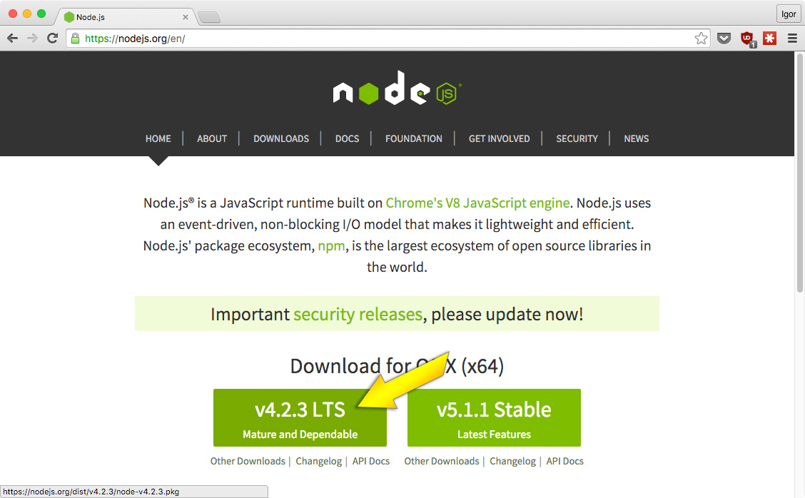
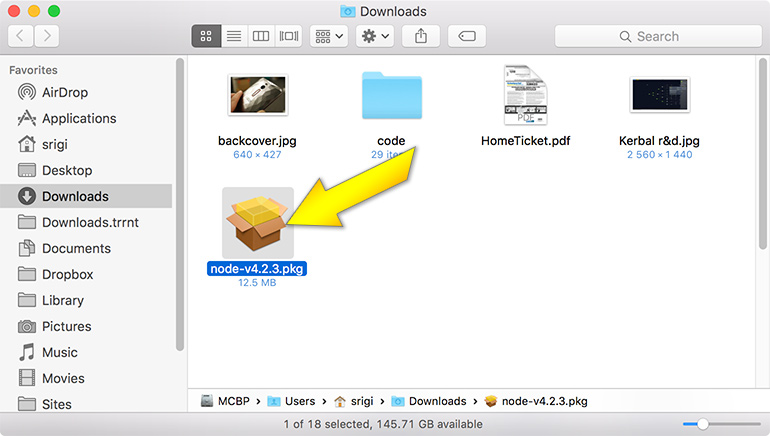
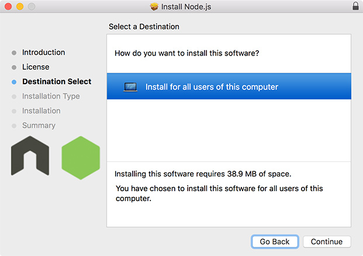
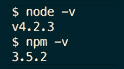

# Nodeschool/Bratislava

Feel free lurk public chatroom @

## Upcoming NodeSchool/Bratislava meetup

planned at **23.1.2015** as *all-day* event in **Progressbar** [(Michalská 3, Bratislava)](https://www.google.com/maps?q=michalska+3,+bratislava).

Please tell us, if you are comming to meetup at
**[this thread (issue)](https://github.com/nodeschool/bratislava/issues/9)**

##### Sponsors are welcome!

##### Pull Requests are welcome!

### [Knowledge Library](https://github.com/nodeschool/bratislava/tree/master/library)
*credits for logo goes to [d14](https://twitter.com/d14)*

# Newcomer to meetup?

Would be good if you can setup your enviroment before meetup, so you can save some time.
Read instructions below and if you are having some problems, feel free to open issue or visit us at chat  

## Installing NodeJS

For obvious reasons, having NodeJS installed on your work machine is a must. :smile:

##### Windows

Using Windows 10, however, workflow should be similar for most versions.

* download v4.2.2 from https://nodejs.org/en/ (5.1.0 has problems with npm and VS2015)
* install it regularly

Open up terminal (Windows + R -> 'cmd' -> Enter) and type `node -v`. If it works, you are good to go and you can ignore the stuff below. Otherwise, continue.

* open up **This PC**
* in that window, right click the **PC** icon located above all your hard drives and directories
* in the new window, click **Advanced system settings**
* in the newest window, click **Environment Variables...**
* find the **PATH** variable, click **edit**
* add the following: *YOUR_ABSOLUTE_NODEJS_INSTALL_DIRECTORY/;* and *C:\Users\YOUR_USERNAME\AppData\Roaming\npm;*
* please note that all PATH variables must be separated with **;**

##### Ubuntu

* open up terminal
* `sudo apt-get install nvm`
* `nvm install 5.1`

##### Mac OS X

Navigate your browser to the [nodejs.org](https://nodejs.org). Download your Node.js installation package by clicking on of the big green buttons (we recommend the LTS variant):

Run downloaded file:

Go through the installation process, provide your password when asked:

Your node is installed at this point, but we recommend some *"fininshing touches"*:

- set the ownership of global module folder

  `sudo chown -R YOUR_USER_NAME /usr/local/lib/node_modules`

  replace `YOUR_USER_NAME` in above command by your actual username in macosx. If you don't know your username, run `whoami` to get it printed into console.

- update to latest NPM

  `npm update -g`

Now you can test your node.js & npm installation:

  `node -v`

  `npm -v`

